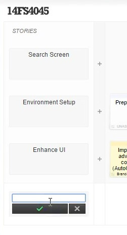
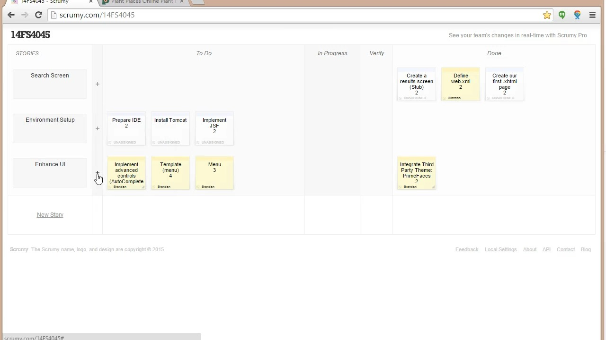
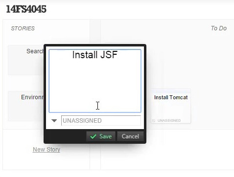
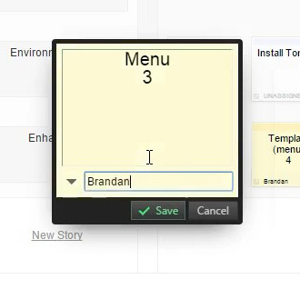
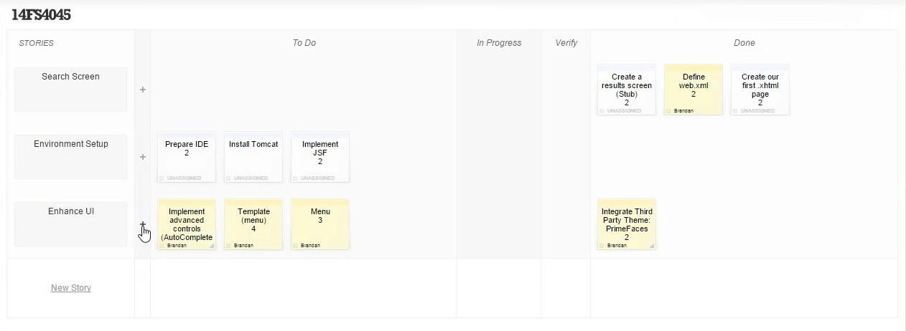
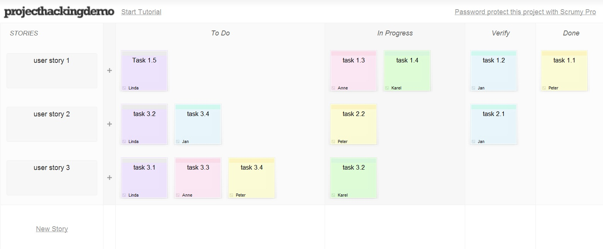
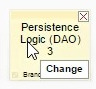
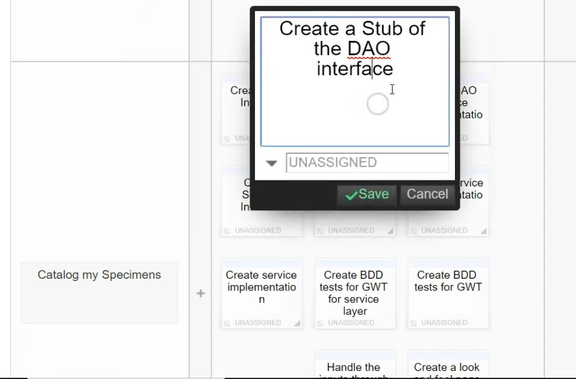

# Scrumyklon

Довольно давно закрылся сервис scrumy.com — это доска задач для SCRUM/AGILE. Я хочу его воссоздать. Пусть работает только в браузере на клиентской части, сохраняя данные в IndexedDB.

## Начало

Если у пользователя нет досок, то пусть открывается `/new` — на ней по центру находится простая форма: поле ввода (фокус должен быть на нем) с названием новой доски и кнопка создания (Enter должен работать). Интерфейс на английском языке.

После создания доски пользователя переносит в `/<id доски>`

## Пустая доска

После создания пользователь видит примерно такую доску (только Stories еще не созданы):

Скриншоты тоже смотри:

- Сверху название доски
- Не нужны: Skip tutorial, border with colors..., подсказки "Hi, I'm Scrumy", подвал (с Scrumy ..., Feedback...)
- Столбцы: STORIES, To Do, In Progress, Verify, Done
- Ссылка-кнопка New Story

## Добавление истории

Нажатие "New Story" в том же месте открывает поле ввода названия новой истории (Enter должен работать, esc - отмена; фокус должен быть в поле ввода):

Справа от добавленной истории появляется кнопка "+" — она нужна для добавления задач в эту историю.

## Добавление задачи

Нажатие кнопки "+" открывает диалог добавления/создания задачи (ctrl+enter добавляет задачу, esc - отмена):

В этом диалоге есть текстовое поле для назначения (assign) задачи. Если в него вводить текст, то цвет задачи меняется (какой-то генератор пастельных цветов на основе текста в этом поле). Если назначение не задано, то карточка белого цвета.

Задача добавляется в колонку "To Do". После добавления задачи выглядят как карточки:

Задачи разных историй визуально отделены друг от друга. В целом, доска выглядит как таблица, у которой каждая история — это строка. В ячейках находятся задачи. Ширина столбцов должна зависеть от количества задач в них. Возможно, как раз <table> и стоит использовать.

Примеры карточек и их цветов:

## Действия с задачами

- задачу можно перетаскивать между колонками и историями. При этом ячейка, в которую попадет задача, должна выделяться (иметь более темный цвет фона)
- при наведении на задачу в правом верхнем углу появляется кнопка X для удаления задачи — после нажатия появляется браузерный диалог подтверждения удаления

- кнопка change не нужна. просто двойной клик открывает редактирование задачи. поле ввода задачи автоматически фокусируется
- диалог выглядит как диалог создания, но есть кнопки save и cancel (ctrl+enter сохраняет задачу, esc - отмена)

## Технологии

- vue, vue router, pinia, tailwind — уже установлены
- indexeddb с помощью библиотеки idb (уже установлена). изучи ее документацию, чтобы разобраться как работать с транзакциями и await: https://github.com/jakearchibald/idb
- иконки использовать от `@lucide/vue` (установлена). https://lucide.dev/guide/vue/getting-started
- перетаскивание реализовать с помощью библиотеки vue-draggable-plus с опцией forceFallback
